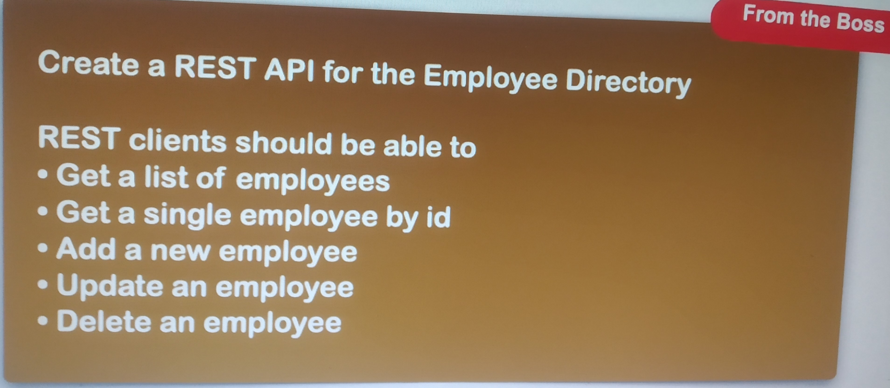

# Spring Boot - REST CRUD Employee

Со второй половины четвёртой и до конца пятой части курса (занятия №112-158) мы писали приложение по шаблону,
имитирующему указание от босса:

В это же приложение добавили Spring Security.

Были покрыты следующие темы:
- DAO and service layers;
- Spring Data Jpa;
- Optional<>;
- Spring Data REST, HATEOAS;
- @RepositoryRestResource;
- pagination and sorting;
- Spring Security;
- security configuration;
- in-memory and database authentications;
- restrict URLs based on roles;
- using custom authorities tables.