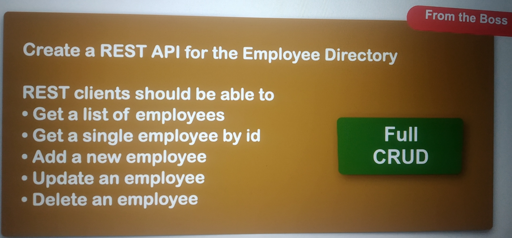

# Spring Boot - REST CRUD Employee

Со второй половины четвёртой части курса мы начали писать приложение по следующему шаблону,
имитирующему указание от босса:

Были покрыты следующие темы:
- DAO and service layers;
- Spring Data Jpa;
- Optional<>;
- Spring Data REST, HATEOAS;
- @RepositoryRestResource;
- pagination and sorting;
- Spring Security;