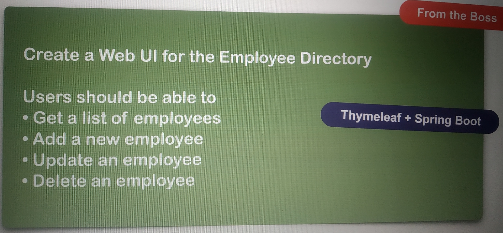

# Spring Boot - Spring MVC CRUD

В седьмой части курса (занятия №212-222) мы писали приложение по шаблону, имитирующему указание 
от босса:

Проект писался на основе более раннего 
[Spring Boot - REST CRUD Employee](https://github.com/AlesiaSherstneva/spring-hibernate-for-beginners/tree/master/04-spring-boot-rest-crud-employee).